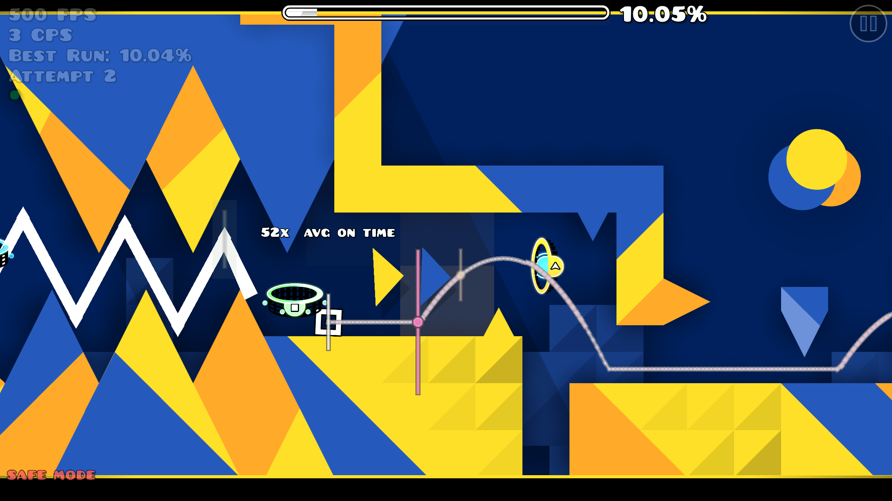
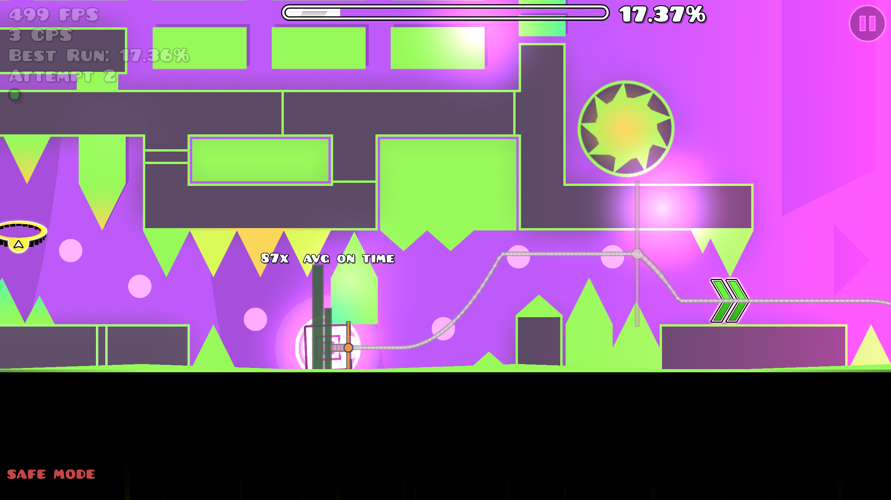
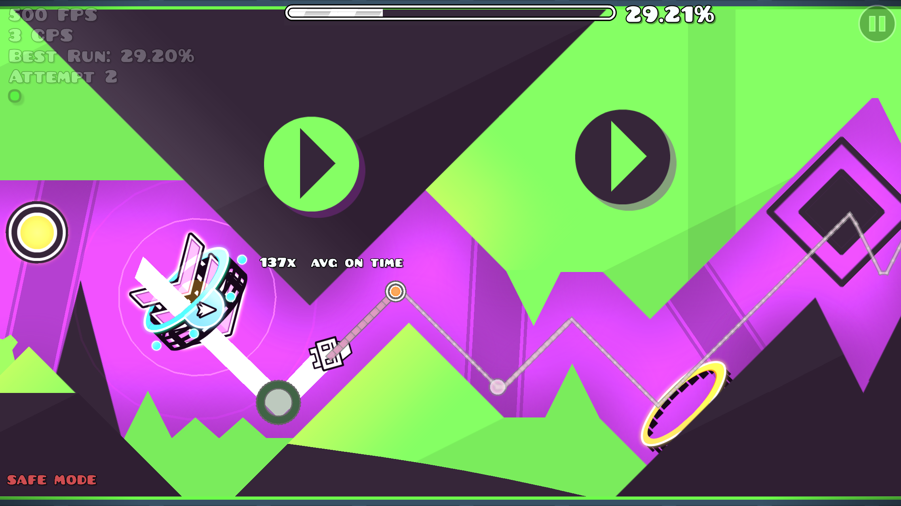
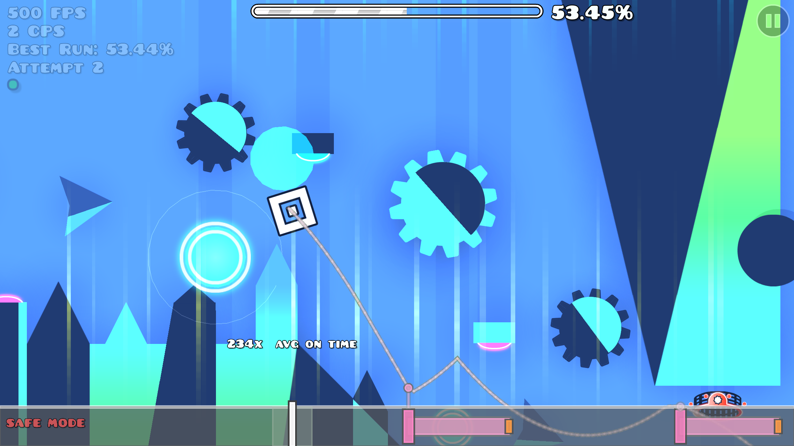
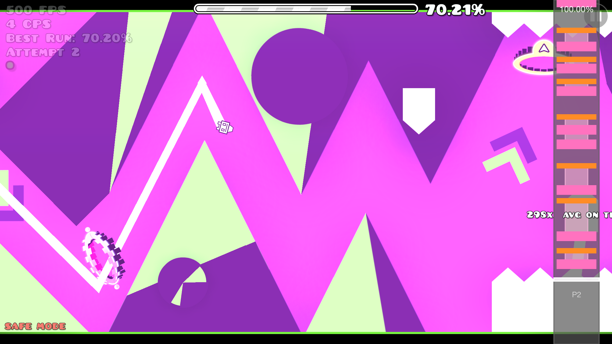
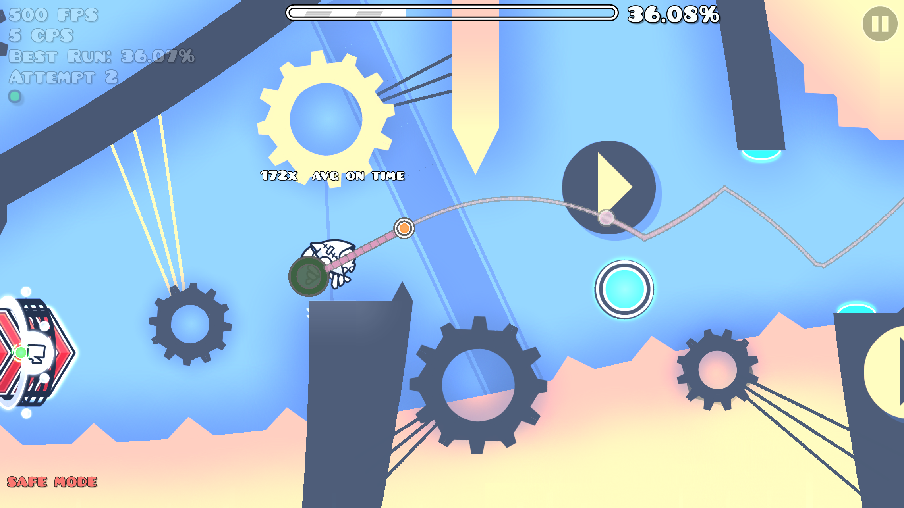
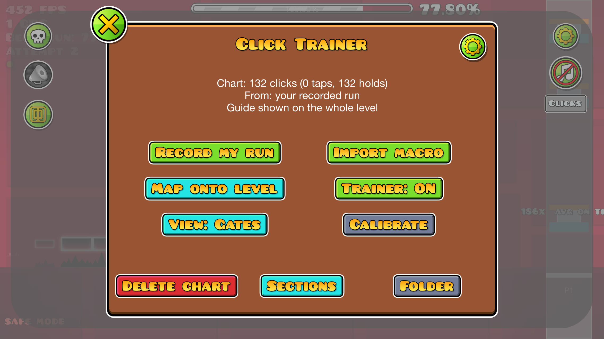
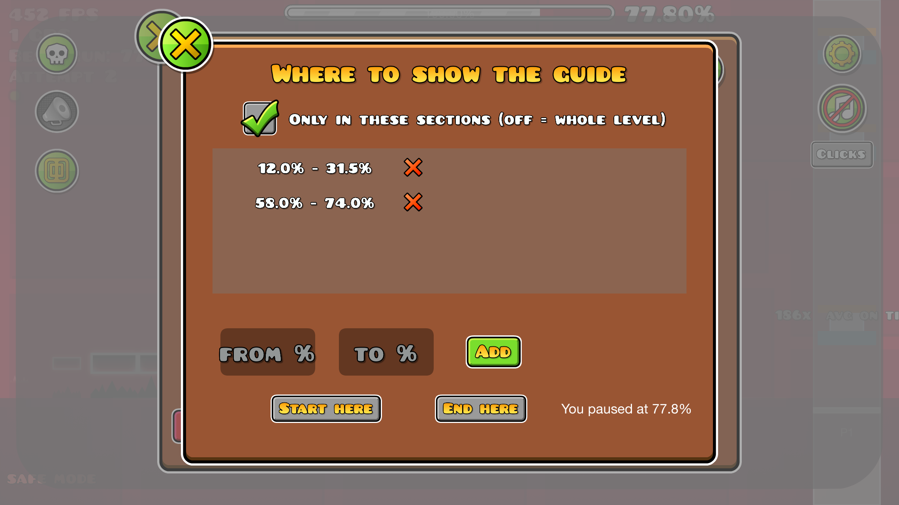

# Click Trainer

A [Geode](https://geode-sdk.org) mod for Geometry Dash that shows you **exactly where and when to click**, right on the level, so you can learn a level's click pattern.

Record your own run in practice mode (or import a bot macro), and the mod turns it into a guide you play along with: gates, closing rings, a click track or an osu!mania-style lane, with live timing feedback.



> This is a practice tool. Attempts with the guide on are automatically put in **safe mode**: no completions, no new best %, nothing saved to your stats.

## Views

Switch in-game with **Alt+V** or the **View** button in the pause menu.

| Gates (default) | Target Rings |
|---|---|
|  |  |
| A thin line in the level where you click, and a thin needle through your icon. **Click when the needle crosses the gate.** Your icon moves at level speed, so the moment is exact. | A dot at the exact spot to click, with a white ring shrinking onto it at a steady speed. **Click when the ring collapses onto the dot.** |

| Click Track | Side Lane |
|---|---|
|  |  |
| A strip along the screen edge. Marks sit right under the spot in the level where you click; click when one reaches the marker under your icon. Doesn't cover the level. | Classic osu!mania-style falling notes. |

In every view:

- **Holds** (ship, wave, UFO…) are drawn along the route, ending in a small **orange "let go"** marker.
- At the exact moment, the target **pops green**. Nothing changes color before that, so green always means *now*.
- Everything has a **dark outline**, so it stays visible on bright and dark backgrounds.
- Feedback next to your icon: **PERFECT / GREAT / GOOD / OK / MISS / EXTRA**, how many ms early or late, combo, and your **average timing**.



## Getting a level's clicks

Open the pause menu in a level and press **Clicks**.



- **Record my run**: restarts the level and records your clicks and route. Use **practice mode** with checkpoints: when you respawn, everything after the checkpoint is thrown away, so only your final successful route is kept. Reach the end and it's saved.
  - Tip: turn on Mega Hack's **Practice Bug Fix** while recording hard levels.
- **Import macro**: use a bot macro from Mega Hack, Eclipse, Pathfinder or xdBot (`.gdr2`, `.gdr.json`, xdBot `.json`, old Mega Hack `.mhr.json`). A short **bot demo** then plays it once to map the clicks onto the level.
- **Copy from another level**: your charts from other levels are listed in Import too, e.g. use your **Acu** chart on an **Acu SP** copy. The route comes along, so it's ready instantly.
- **Start positions** are supported: the guide lines up with wherever you spawn.

Charts are saved per level, so each level is set up once.

## Sections

Only want help on the hard parts? **Clicks → Sections** lets you pick parts of the level by percentage (type them, or use **Start here / End here** while paused). Outside your sections nothing is shown or judged.



## Settings

Open them from the **gear icon** in the Clicks menu; changes apply immediately.

- View, ring closing time, how many clicks ahead are shown, circle/gate sizes, release marker size
- Opacity of trail, markers and rings; dark outline on/off; all colors
- **Click sound**: a mechanical keyboard click at each of the chart's clicks, right when the cue hits, so you can click along by ear; on/off and volume
- **Calibrate**: shifts the visuals by your average early/late so the cue matches when you actually click
- Hotkeys: **Alt+C** guide on/off, **Alt+V** switch view

## Install

1. Install [Geode](https://geode-sdk.org) (Geometry Dash 2.2081, Windows).
2. Download `lmati.click-trainer.geode` from the [latest release](../../releases/latest).
3. Put it in `Geometry Dash/geode/mods/` and restart the game.

## Building

Needs Visual Studio 2022 Build Tools (C++), CMake, Ninja, the [Geode CLI](https://github.com/geode-sdk/cli) and the Geode SDK (`GEODE_SDK` env var).

```bash
cmake -B build -G Ninja -DCMAKE_BUILD_TYPE=RelWithDebInfo
cmake --build build --target ClickTrainer_PACKAGE
```

`build.bat` does the same from a VS developer environment and installs the mod into your game.

The README screenshots are taken by the mod itself: launch GD with `--geode:ct-showcase=<level id>` (the level needs a chart with a route) and they're saved to the mod's save folder.

## How it works (short)

- Clicks are recorded on GD's physics tick counter (480 per second), along with your icon's position each tick (the "route").
- Markers are drawn in the level's own coordinates, right after each physics step, so they never lag behind your icon.
- Bot macros are read with [GDReplayFormat](https://github.com/maxnut/GDReplayFormat) (GDR2).
- Safe mode works by treating guided attempts like start-position test runs, so GD doesn't save them. With [Eclipse](https://github.com/EclipseMenu/EclipseMenu) installed, the mod also registers itself in Eclipse's cheat indicator.
